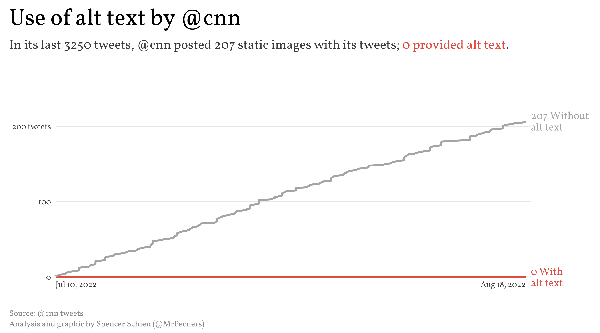
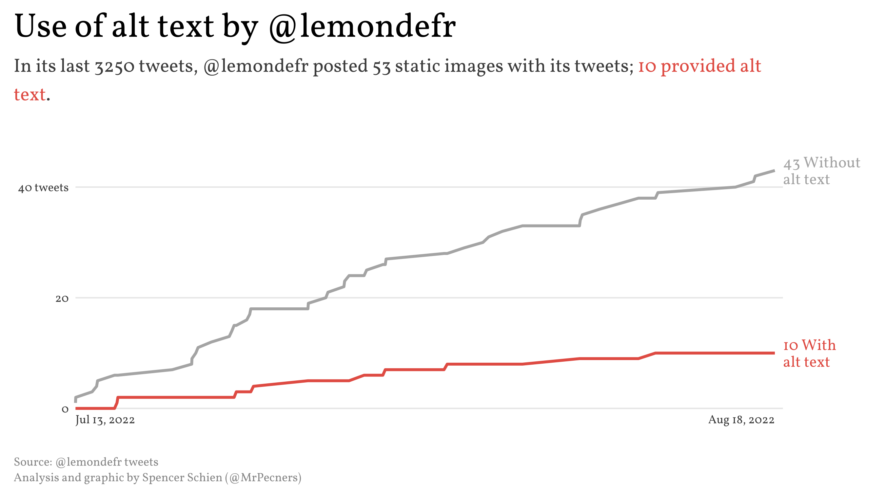
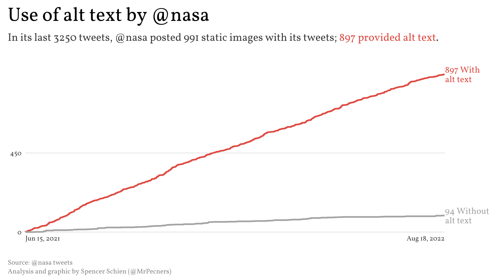
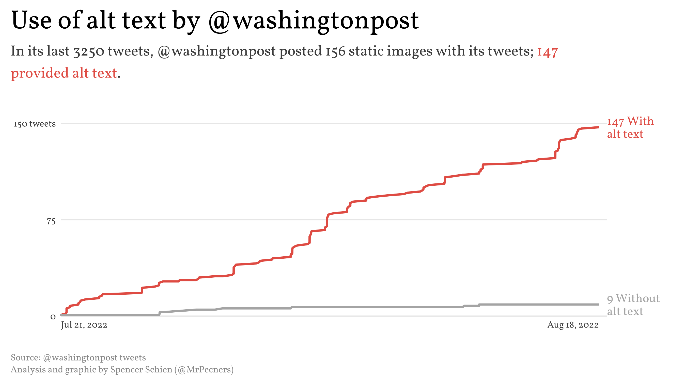
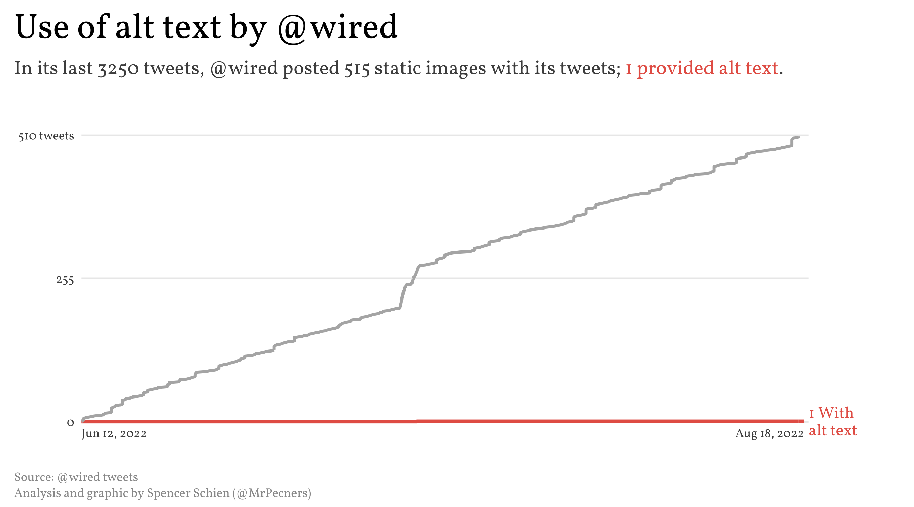

# About

I noticed that the NYTimes main Twitter account ([@nytimes](https://twitter.com/nytimes)) seems to be hit or miss in adding alt text with images. To investigate if this represents a pattern, I pulled 3,250 of their most recent tweets. The result? Yes, it appears to be a pattern.

This repo holds the code pull the tweets and conduct this analysis in R. If you wish to reproduce this, you will have to authenticate yourself, and I didn't include my authentication here.

