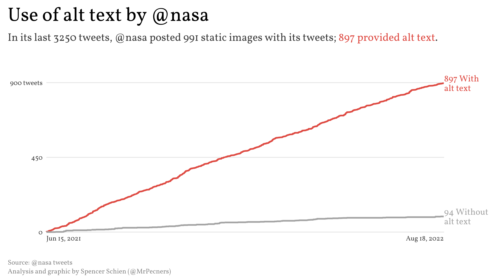
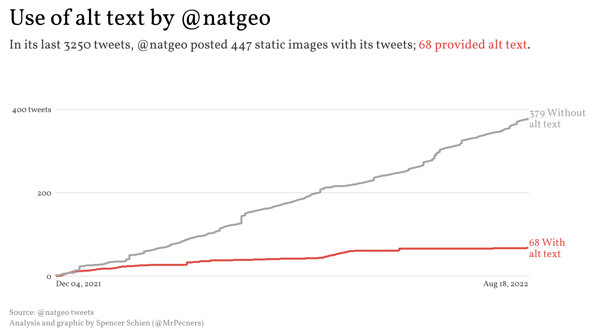
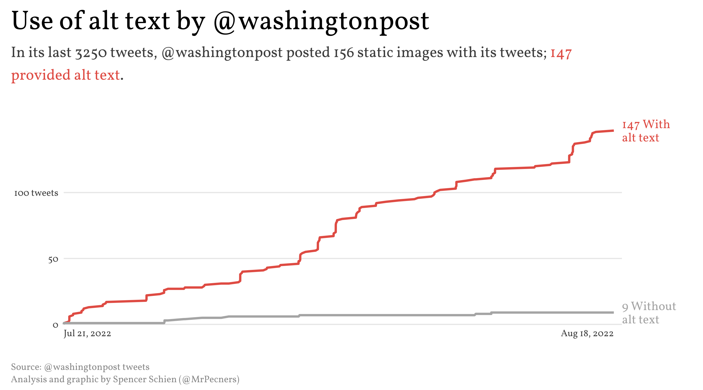
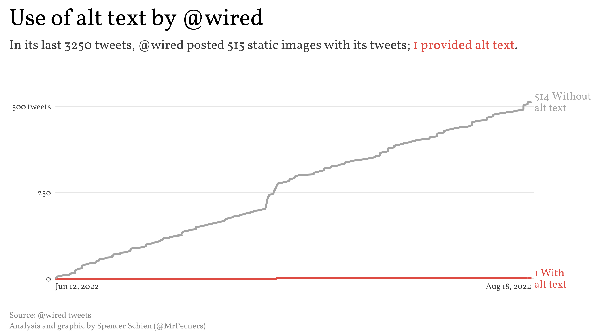
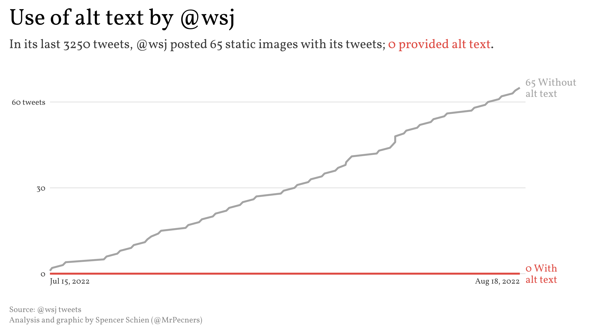

# About

I noticed that the NYTimes main Twitter account ([@nytimes](https://twitter.com/nytimes)) seems to be hit or miss in adding alt text with images. To investigate if this represents a pattern, I pulled 3,250 of their most recent tweets. The result? Yes, it appears to be a pattern.

This repo holds the code pull the tweets and conduct this analysis in R. If you wish to reproduce this, you will have to authenticate yourself, and I didn't include my authentication here.

UPDATE: You'll notice that I've included analysis of tweets from more accounts. I expanded this analysis to provide comparisons with other accounts, plus I improved the script so that rate limits would be less of an issue. 

